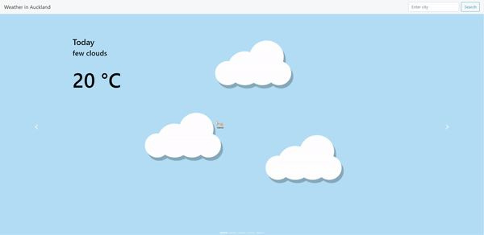
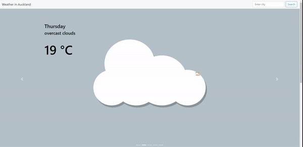
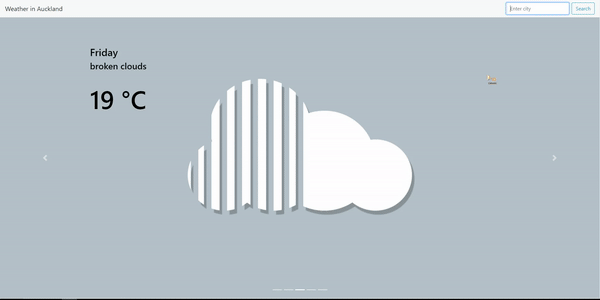

# FLASK world temperature app
A web app made using Flask that shows the temperature given a city. I made this following a flask tutorial by PrettyPrinted who used US postal codes the display temperature instead. You can find his video here: https://www.youtube.com/watch?v=sbYXa6HJJ5M.

## Built With

* [Flask](http://flask.pocoo.org/) - The web framework used
* [Open Weather API](https://openweathermap.org/api) - Weather API
* [Pygal](http://pygal.org/en/stable/) - Python graph API
* [Bootstrap](https://getbootstrap.com/) - Simple dimple html, css and javascript

## Website
There are still alot of bugs and what not with this site and it doesn't look 'sexy' enough yet so i'm not hosting it anymore. I will put it up when it looks cool and works alot better.

## Current Version
The current version takes a given city and outputs weather for the next 5 days at that city. The main changes from the previous iteration is just the graphs and the footer

### Examples
A carousel with a small description of the day and the average temperature of the day

Graphs showing the temperature, humidity and windspeeds throughout the day in three hour intervals.

A search bar so you can search the weather at a different city.

  

