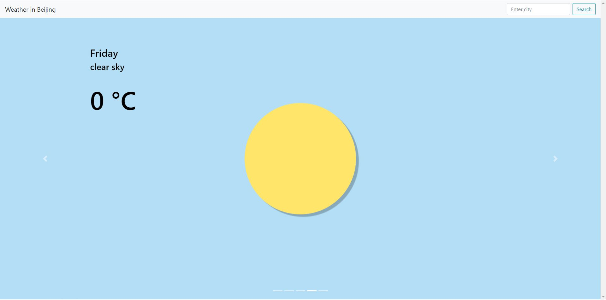
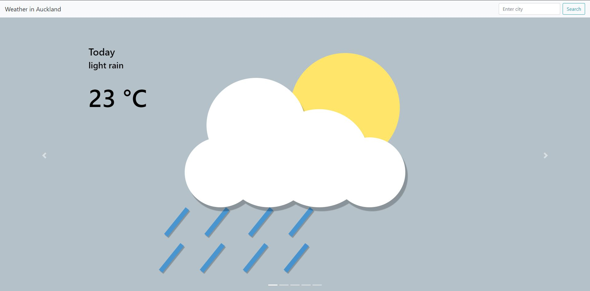
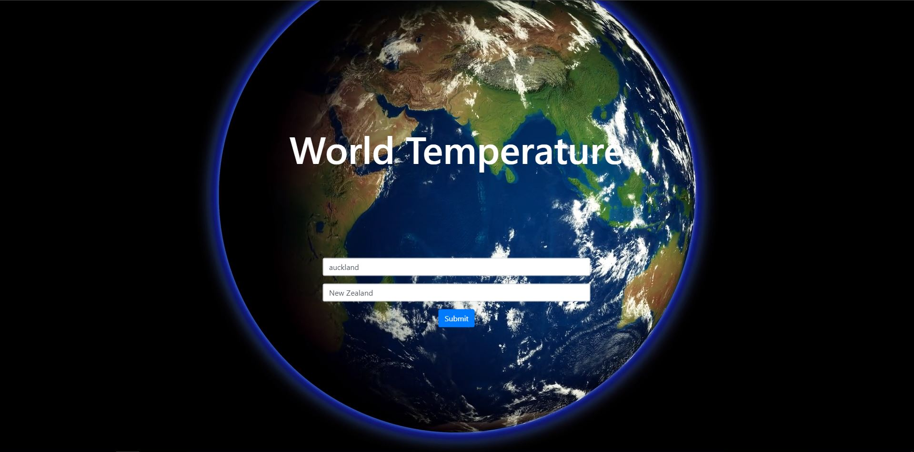

# FLASK world temperature app
A web app made using Flask that shows the temperature given a city. I made this following a flask tutorial by PrettyPrinted who used US postal codes the display temperature instead. You can find his video here: https://www.youtube.com/watch?v=sbYXa6HJJ5M.

## Built With

* [Flask](http://flask.pocoo.org/) - The web framework used
* [Open Weather API](https://openweathermap.org/api) - Weather API
* [Bootstrap](https://getbootstrap.com/) - Simple dimple html, css and javascript

## Website
There are still alot of bugs and what not with this site and it doesn't look 'sexy' enough yet so i'm not hosting it anymore. I will put it up when it looks cool and works alot better.

## Current Version
The current version takes a given city and outputs weather for the next 5 days at that city. The main changes from the previous iteration is just the backgrounds and the description of the weather. I'll be adding more functionality in the next version by showing graphs of temperature change during a day and also possibly switching from a carousel to a tabs feature as i've seen most weather apps use that instead and it seems more convenient.

## Previous Versions

  

  
  
  
  

