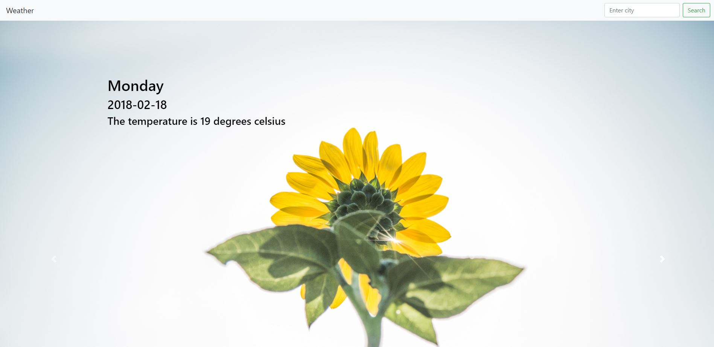
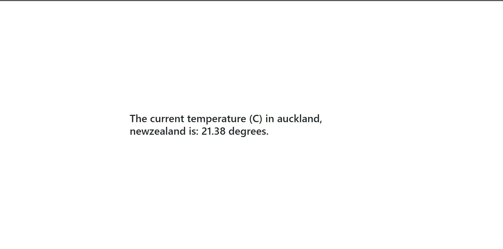

# FLASK world temperature app
A web app made using Flask that shows the temperature given a city and a country. I made this following a flask tutorial by PrettyPrinted who used US postal codes the display temperature instead. You can find his video here: https://www.youtube.com/watch?v=sbYXa6HJJ5M.

## Built With

* [Flask](http://flask.pocoo.org/) - The web framework used
* [Open Weather API](https://openweathermap.org/api) - Weather API
* [Bootstrap](https://getbootstrap.com/) - Simple dimple html, css and javascript

## Website
There are still alot of bugs and what not with this site and it doesn't look 'sexy' enough yet so i'm not hosting it anymore. I will put it up when it looks cool and works alot better.

## Current Version

This is just a simple design right now and I will be adding alot more to it but for now it atleast looks presentable :). You enter a city name in the top right corner and it shows the temperature at that city for the next 5 days. Each day is one carousel and you can navigate the carousel with the left and right buttons or it automatically switches.

## Previous Versions

  ### Version One:
  I was very unhappy about this version it just looked ugly to me.
  
  This is the home page where you enter city and country name.
  

  This is the example output.
  

